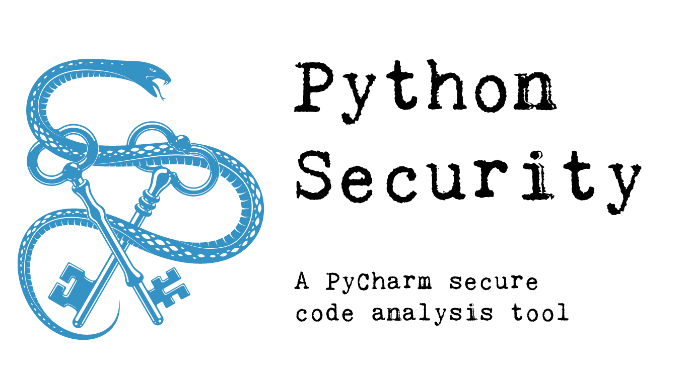

# PyCharm Python Security plugin

A plugin to run security checks for common flaws in Python code and suggest quick fixes.

* Available as a PyCharm plugin on the [Jetbrains plugin marketplace](https://plugins.jetbrains.com/plugin/13609-python-security)
* Available as a GitHub Action for your CI/CD workflow [on the GitHub Marketplace](https://github.com/marketplace/actions/pycharm-python-security-scanner).
* Available as a standalone container image [on the Docker Hub](https://hub.docker.com/r/anthonypjshaw/pycharm-security)

## Documentation

Documentation is available on [pycharm-security.readthedocs.io](https://pycharm-security.readthedocs.io/en/latest/?badge=latest), including examples and explanations for all the checks.

## GitHub Action Documentation

Documentation for the GitHub action is [on the documentation site](https://pycharm-security.readthedocs.io/en/latest/github.html).

## SafetyDB

This plugin will check the installed packages in your Python projects against the SafetyDB and raise a warning for any vulnerabilities.

## Current checks

See [Supported Checks](https://pycharm-security.readthedocs.io/en/latest/checks/index.html) for a current list.

## Current quick fixes

See [Fixes](https://pycharm-security.readthedocs.io/en/latest/fixes/index.html) for a current list.

## Release History

See [Release History](HISTORY.md) for the release history.

## Contributing

If you would like to alter or add new checks and fixes, see the [Development](https://pycharm-security.readthedocs.io/en/latest/development.html) page.

## License

This project is [MIT Licensed](LICENSE).

## Credits

Credit to the [PyUp.io](https://pyup.io/) team for the SafetyDB. This project uses [SafetyDB](https://github.com/pyupio/safety-db) to scan packages, SafetyDB is licensed under ["Attribution-NonCommercial 4.0 International" license](src/main/java/resources/safety-db/LICENSE.txt).

