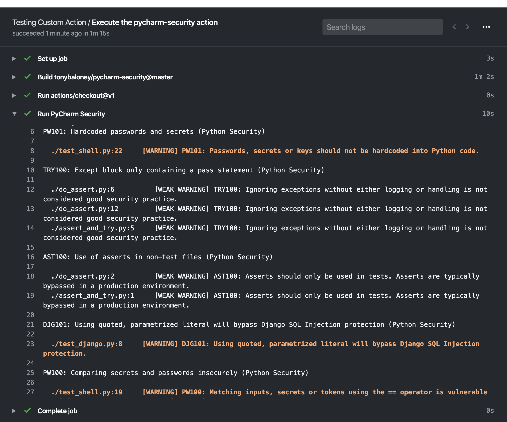
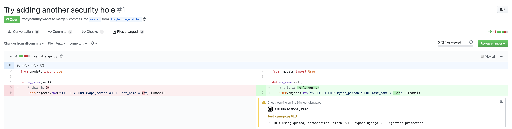
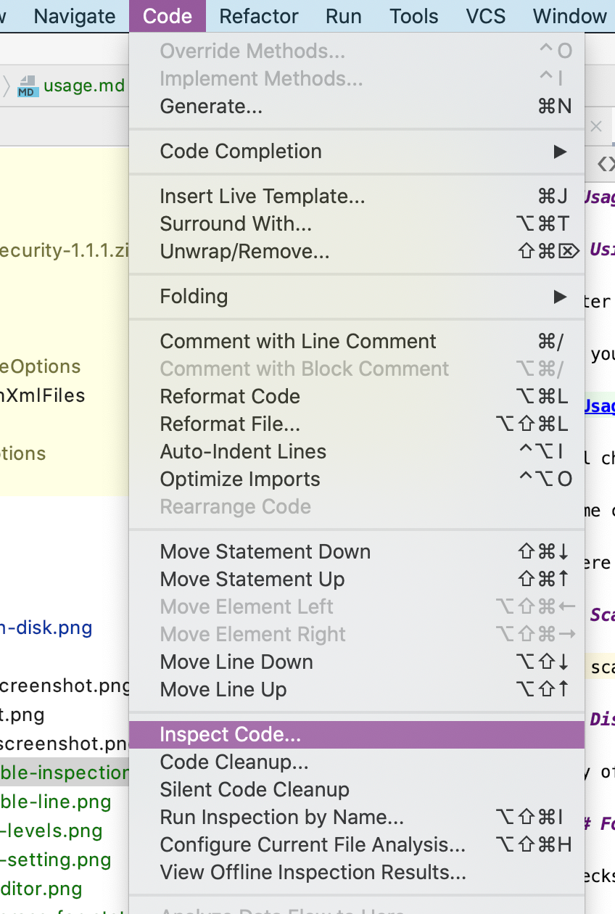
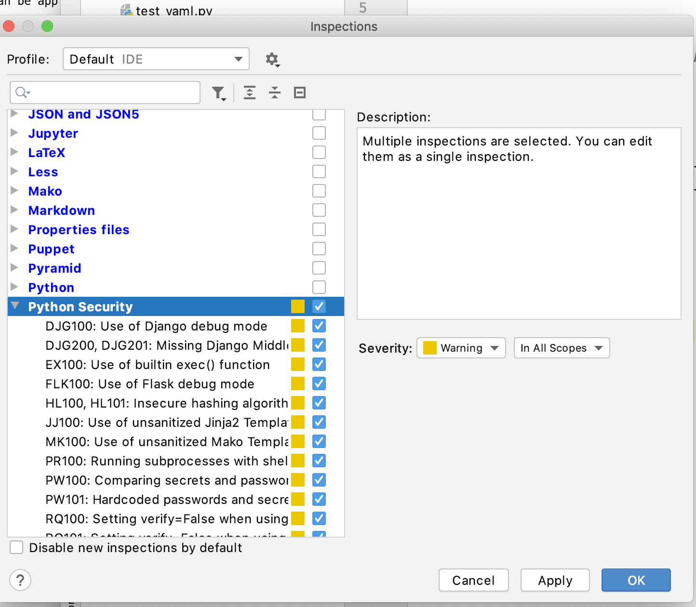

# GitHub Action

The PyCharm Security plugin is available as a CI/CD workflow for GitHub Actions on the [GitHub Marketplace](https://github.com/marketplace/actions/pycharm-python-security-scanner).

## Example

This plugin will inspect the GitHub Workplace for Python code and report on vulnerabilities

```yaml
on: [push]

jobs:
  security_checks:
    runs-on: ubuntu-latest
    name: Execute the pycharm-security action
    steps:
      - uses: actions/checkout@v1
      - name: Run PyCharm Security
        uses: tonybaloney/pycharm-security@master
```

This would give a log of issues inside the report:



Any issues will be annotated in the files where the changes were detected (such as a commit or pull-request):



## List of vulnerabilities and inspections

See [check index](checks/index) for a list of currently supported inspections.

## Additional configuration

### Specifying target path

If you wish to only scan a subdirectory within your code checkout, add the `path` argument with the relative path from the root.

For example, to scan the `src` subdirectory:

```yaml
      - name: Run PyCharm Security
        uses: tonybaloney/pycharm-security@master
        with:
          path: src/
```

### Failing a task on warnings

If you want the task to fail if warnings were found, use the `fail_on_warnings` argument and set it to `"yes"`.

### Using a custom inspection profile

If your project has a custom inspection profile you can use the `profile` argument and the relative path to your inspection profile XML file.

For example:

```yaml
      - name: Run PyCharm Security
        uses: tonybaloney/pycharm-security@master
        with:
          profile: customProfile.xml
```

### Creating a custom inspection profile from PyCharm

Navigate to the **Inspect Code** from the **Code** menu



This will pop up with the Inspections Profile Window. 

Click the `...` ellipsis to edit the inspection profiles.

From here, choose the inspections you want to run, then select the **Python Security** group:



You can customize the severity. Save the inspection profile with the name "**Security**" (or similar), by clicking on the cog and choosing **Copy to Project**.

Make sure the inspection profile is checked in to your git repository for the plugin to use it. They are usually saved into `.idea/inspectionProfiles/`.
