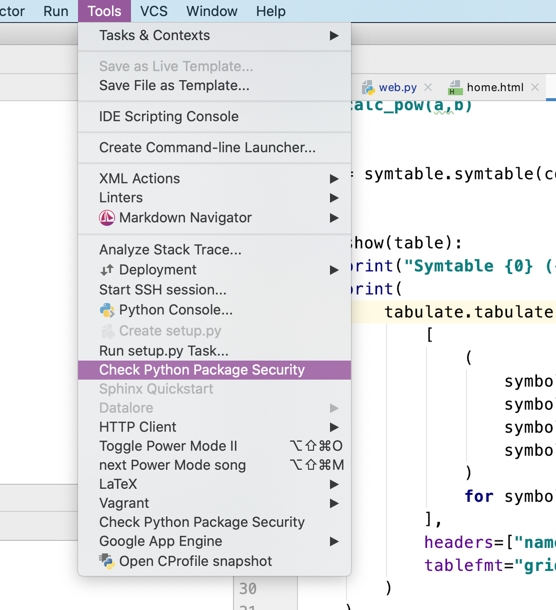

.. PyCharm Python Security plugin documentation master file, created by
   sphinx-quickstart on Fri Jan 17 08:45:37 2020.
   You can adapt this file completely to your liking, but it should at least
   contain the root `toctree` directive.

PyCharm Python Security plugin
==============================

Pycharm-security is a plugin for PyCharm, or JetBrains IDEs with the Python plugin.

The plugin looks at your Python code for common security vulnerabilities and suggests fixes.

.. image:: https://readthedocs.org/projects/wily/badge/?version=latest
    :target: https://wily.readthedocs.io/en/latest/?badge=latest
    :alt: Documentation Status
.. image:: https://github.com/tonybaloney/pycharm-security/workflows/CI/badge.svg
    :target: https://github.com/tonybaloney/pycharm-security/actions
    :alt: GitHub CI Status
.. image:: https://img.shields.io/jetbrains/plugin/v/13609-python-security.svg
    :target: https://plugins.jetbrains.com/plugin/13609-python-security
    :alt: Plugin Downloads
.. image:: https://img.shields.io/jetbrains/plugin/d/13609-python-security.svg
    :target: https://plugins.jetbrains.com/plugin/13609-python-security
    :alt: Plugin Version
.. image:: https://codecov.io/gh/tonybaloney/pycharm-security/branch/master/graph/badge.svg
    :target: https://codecov.io/gh/tonybaloney/pycharm-security
    :alt: Coverage Status

.. toctree::
   :maxdepth: 2
   :caption: Contents:

   installation
   checks
   fixes
   development

Features
~~~~~~~~

.. image:: _static/screenshot.png

Package Scanner
---------------

This plugin will check the installed packages in your Python projects against an offline copy SafetyDB and raise a warning for any vulnerabilities.

.. image:: _static/safetydb-screenshot.png

This process is initiated at Project load time, also it can be executed via the `Tools > Check Python Package Security` menu item:

