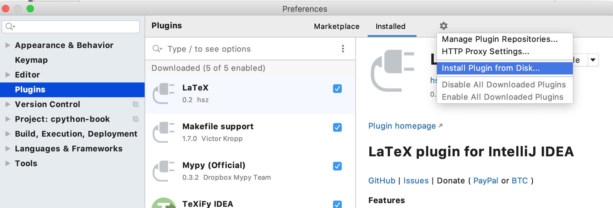

# Installation

## Installation from marketplace (recommended method)

You can install the plugin on the [Jetbrains plugin marketplace](https://plugins.jetbrains.com/plugin/13609-python-security).

Plugin releases are verified by JetBrains, so there is normally a lag between a release on Github and one in the marketplace whilst the release is verified.

## Installation from GitHub

If you want to install a specific version, go to the [releases](https://github.com/tonybaloney/pycharm-security/releases) page and download the `pycharm-security-xxx.zip` file.
Inside PyCharm,



## Installation from source

You can build from source with IntelliJ IDEA. Open this repository and run the `:buildPlugin` task. Inside `build/distributions/` will be a copy of `pycharm-security-xxx.zip`. Use the Installation from Disk instructions to complete the install

## Installation from Docker

This plugin can also be used from docker as a command-line utility:

```console
$ docker pull anthonypjshaw/pycharm-security
```

To execute, mount your code to scan as the mount path. Warnings will be printed to the screen:

```console
$ docker run -v /path/to/yourcode:/code anthonypjshaw/pycharm-security

PW100: Comparing secrets and passwords insecurely (Python Security)

  ./test_shell.py:19     [WARNING] PW100: Matching inputs, secrets or tokens using the == operator is vulnerable to timing attacks. Use compare_digest() instead.

PW101: Hardcoded passwords and secrets (Python Security)

  ./test_shell.py:22     [WARNING] PW101: Passwords, secrets or keys should not be hardcoded into Python code.
```
