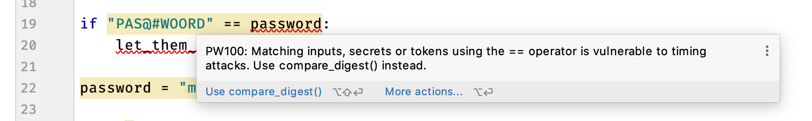
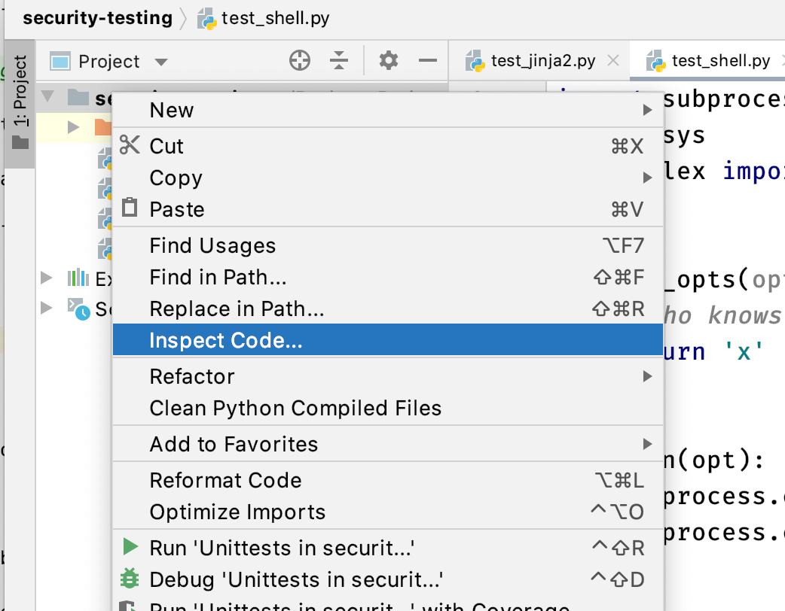
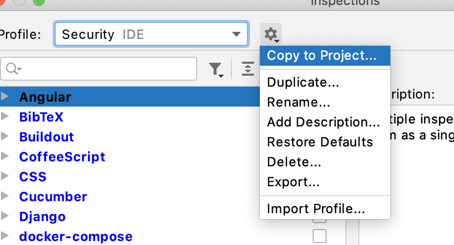
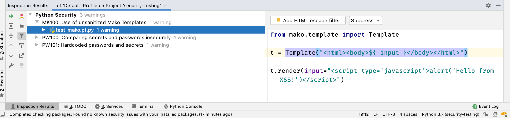
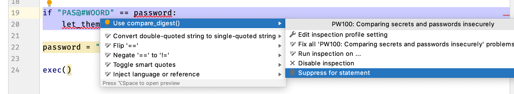
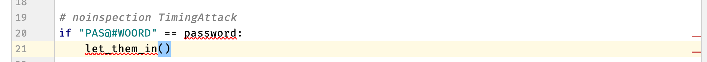
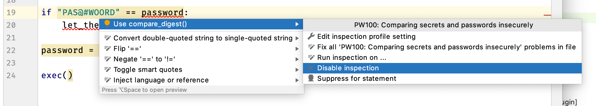
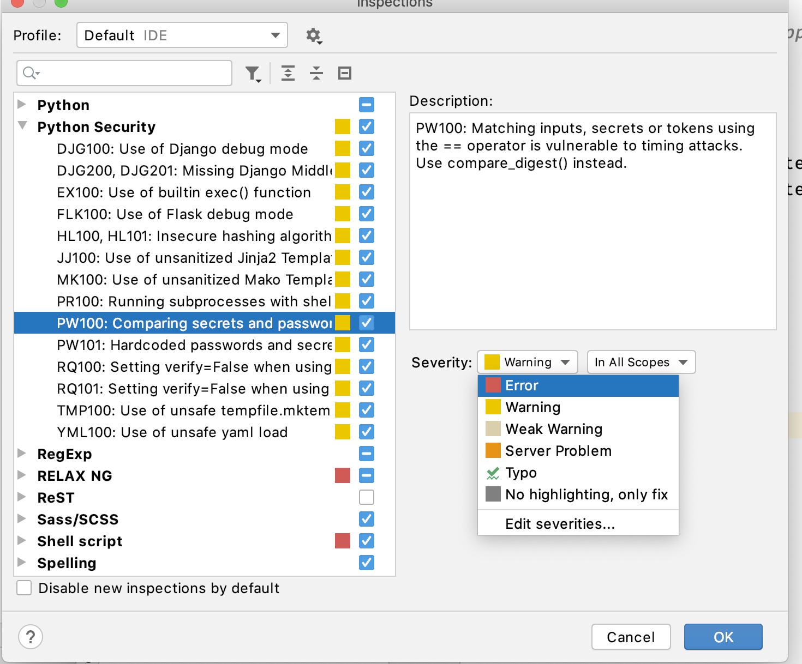
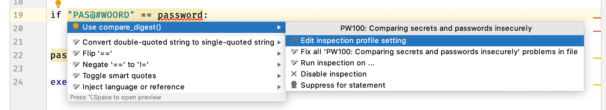

# Usage

## Using this plugin within the editor

After installing this plugin, whenever a check detects some code that might cause a security vulnerability, it will be highlighted in Yellow.

If you hover over the highlighted line, or select **Show Context Actions**, PyCharm will tell you the check identifier, and a brief description.

All checks are documented on the site. Using the code, you can look up details in [List of Checks](checks/index).

Some checks have automatic **Quick Fixes** available, listed on [List of Fixes](fixes/index).

Where a quick fix is available, it can be applied using the quick fix shortcut key in PyCharm, or by clicking the action in the Context Window.

## Scanning an entire project

To scan an entire project, navigate to the **Inspect Code** from the **Code** menu

To scan a directory, right click on it from the Project panel, and selecting **Inspect Code** from the menu:

This will pop up with the Inspections Profile Window. 

Click the `...` ellipsis to edit the inspection profiles.

From here, deselect all inspections, then select the **Python Security** group:

You can customize the severity for this particular run. Save the inspection profile with the name "**Security**" (or similar), by clicking on the cog and choosing **Copy to Project**.

    You can also use **Copy to IDE** to reuse this profile for any project.

Once completed, the **Inspection Results** pane at the bottom will show any discovered issues:

If Quick Fixes are available they can be applied here to a single occurrence, file or the whole project. Use the Quick Fix (Lightbulb) icon on the right hand side.

## Disabling checks

Any of the checks can be disabled directly from PyCharm, just as you would with PyCharm's builtin inspection rules.

### For a statement

Checks can be disabled for a given statement by adding a `noinspection` comment above the line with the check identifier.

This is available as a shortcut from the context window as **Suppress for statement**.

The editor will add a comment above your code to disable that check

To re-enable inspection, remove the commented line

### For a project or globally

Any checks can be disabled for an entire project, or globally for your editor.

From the context panel for the check you want to disable, select **Disable Inspection**

This can be re-enabled from the Inspections configuration panel in __Preferences -> Editor -> Inspections__.

## Customizing the severity levels

In PyCharm, navigate to __Preferences -> Editor -> Inspections__ and find the __Python Security__ Group:

The severity levels for any check can be configured in this pane.

Some checks are grouped together because they have very similar styles, e.g. the Django middleware checks (DJG200, DJG201) are bundled.

There is a shortcut to this window from the context menu:

